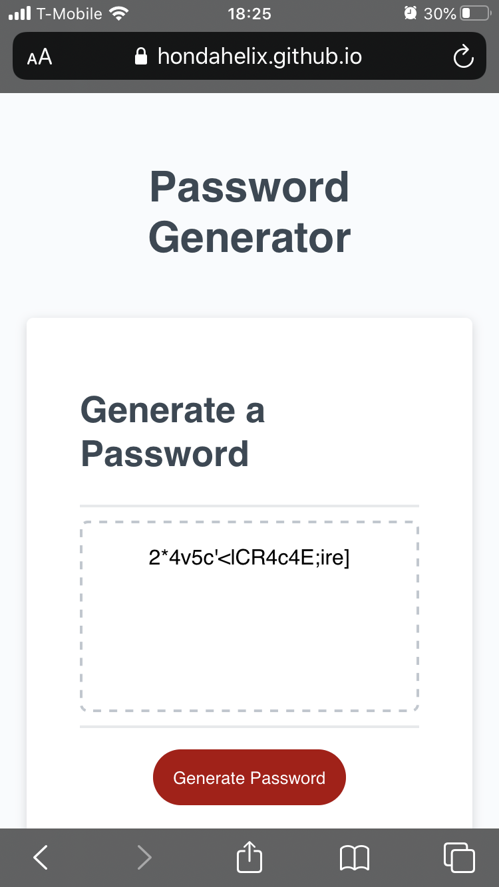
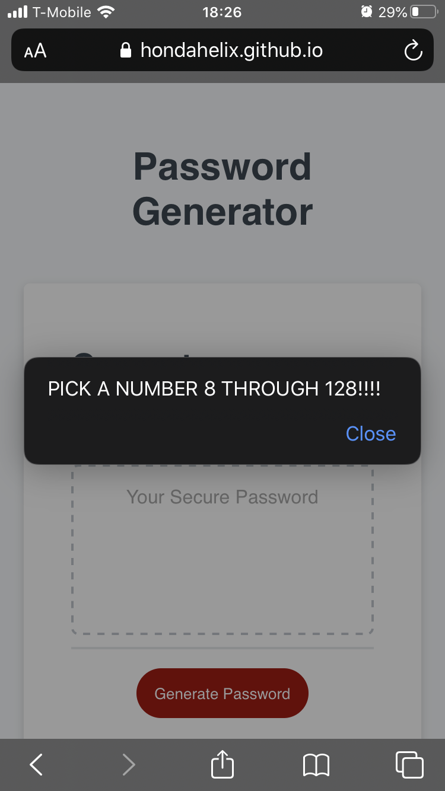
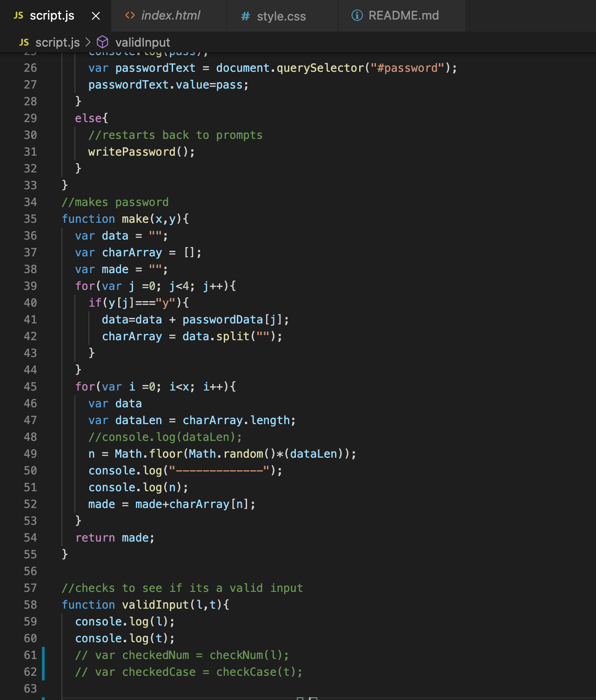

# password_generator

## Description 

This project sought to generate a password based on the criteria from the user. This password generator asks the user the length that they want the password to be. It then asks the user if they would like to include lowercase letters, uppercase letters, numbers, and special characters. Then the results will be displayed on the page. 

This was my first exposure and practice of using javascript. I experienced many difficulties at first, especially the problem of how to get user input into my code and how to check the inputs to see if they were valid. I solved this by making functions that checked if the input was accurate and then returned a boolean. Using these functions helped me better organize my code so that I did not get lost. Furthermore, I believe that the way I generated the password was unconventional because the way I went about it was that I added the characters that the user wanted to use into a string that was then split into an array, and then these elements were picked randomly.

I also learned a valuable lesson of naming my variables so that I remember what they are. This was not too big of a problem for me while I was coding, but when I took a second look at it, I realized it would be difficult for other developers to follow along. This is an aspect of my coding that I will improve on in my other projects.

## Table of Contents 

* [Installation](#installation)
* [Usage](#usage)
* [Credits](#credits)
* [Badges](#badges)

## Installation

The installation for this project is to go my github repositories then navigate to Code_Refractor or click this link [Responsive Portfolio](https://github.com/hondahelix/responsive_portfolio) then click on the green code button in the top right. Then you can copy the code via ssh or by downloading a zip file.

## Usage 

In this age of technology, a strong password is essential to keep your privacy and information security. This is why I decided to practice javascript to create this web application. This password generator can generate a password up to 128 characters and lowercase, uppercase, numbers, and special characters. Even if it's just updating someone's current password by adding a random generated eight characters to the end of an existing password, this application is useful to enable security. 

                iPhone screenshot of page

                Phone screenshot of invalid input

        Computer screenshot of how password is generated

## Credits
Third party assets and instruction was provided by the University of California, Berkeley Full Stack Coding Bootcamp program. 

[UCB Coding Bootcamp](https://bootcamp.berkeley.edu/coding)

---

## Badges

